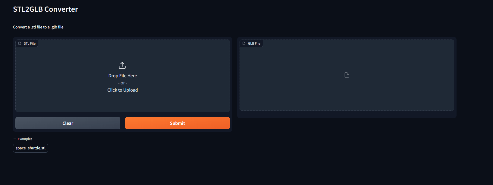

# STL2GLB

Check out the configuration reference at https://huggingface.co/docs/hub/spaces-config-reference



## Overview

The STL2GLB project is a simple tool that converts 3D models in STL format to GLB format. The conversion is powered by [trimesh](https://trimsh.org) and features an interactive Gradio interface. This project is containerized using Docker for easy deployment.

## Features

- Convert 3D models from STL to GLB format.
- Clean up temporary files created during conversion.
- Interactive model uploader and viewer using [Gradio](https://gradio.app).

# Getting Started

## Prerequisites

- Python 3.10 or newer.
- [Git LFS](https://git-lfs.github.com/) installed to work with large STL files.
- Docker (optional) for containerized deployment.

## Installation

1. Clone the repository:

```bash
git clone https://github.com/Hal51AI/STL2GLB.git
cd STL2GLB
```

2. Install dependencies:

```bash
pip install -r requirements.txt
```

## Running the Application Locally

Run the application using Python:

```bash
python app.py
```

This will launch the Gradio interface (by default on port 7860) where you can upload an STL file, convert it to GLB, and view the result.

## Running with Docker

1. Build the Docker image:

```bash
docker build -t stl2glb .
```

2. Run the Docker container:

```bash
docker run -p 7860:7860 stl2glb
```

The application will be available at http://0.0.0.0:7860.

    